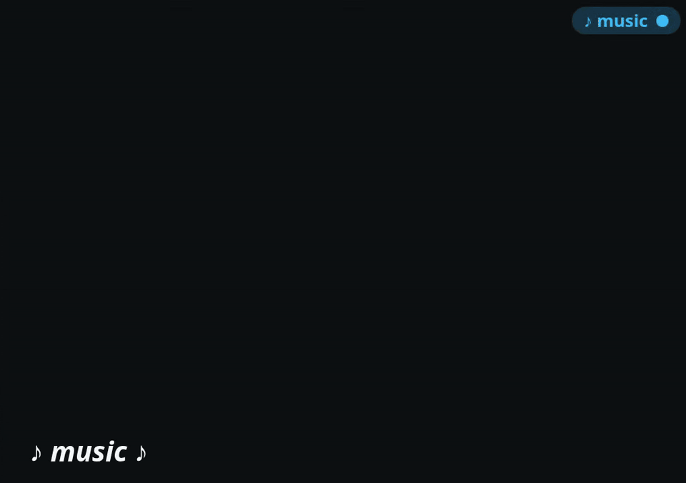

# livecaption

Live captions from your soundboard to phones, projectors, and streaming software.

livecaption runs on a Linux machine connected to your soundboard. It sends audio to
Deepgram or Speechmatics and serves the captions on your local network. Viewers open a
web page — no app or account needed.



> A quick maintainer note: This project was set up to be a solution to provide a speech to text captions using basic but reliable equipment. We wanted something that was not just leaving someones phone randomly plugged in somewhere or trying to use a random website as a critical live event production tool. High end professional solutions cover the upper range of the market, but this project aims to be a good middle ground. Real equipment running a local web server with a solid architecture.

## Choose your setup

The caption server produces the captions. An optional kiosk displays them on a dedicated
screen; phones and other browsers can connect directly without it.

| | Caption server | Caption kiosk |
|---|---|---|
| Role | Captures soundboard audio and serves captions | Displays captions from an existing server |
| Package | `livecaption` | `livecaption-kiosk` |
| Current target | Chromebox CN60, Debian Trixie | Chromebook, Debian Trixie with a desktop |
| On startup | Runs headless as a systemd service | Logs in automatically and opens Firefox full-screen |
| Instructions | **[Server setup](deploy/README.md)** | **[Kiosk setup](deploy-kiosk/README.md)** |

Both packages are available from the same apt repository. The guides cover adding the
repository, configuration, and checks before use at an event.

The server needs `ffmpeg`, a soundboard audio feed, and a Deepgram or Speechmatics API key.
Internet access is required for speech recognition; viewers connect over the local network.
The kiosk needs a graphical desktop and can run on a separate machine. It keeps the display
awake and restarts Firefox if it exits.

## Try it locally

With Go, `ffmpeg`, and [just](https://github.com/casey/just) installed, build from this checkout
and replay the included demo:

```sh
just build
./bin/livecaption replay examples/demo.mp3 --engine mock --no-transcript
```

The [65-second demo](examples/README.md) contains 10 seconds of instrumental music followed
by an excerpt from Chapter 1 of *Moby-Dick*. No recording of your own is needed.

Open <http://localhost:8080/>. The mock engine emits canned captions — it does not transcribe
the recording — so this needs no API key, audio hardware, or speech-service connection.
Playback runs in real time.

To transcribe the recording, set an API key and select its engine:

```sh
export DEEPGRAM_API_KEY="your-key"
./bin/livecaption replay examples/demo.mp3 --engine deepgram
```

For Speechmatics, use `SPEECHMATICS_API_KEY` and `--engine speechmatics`; this also lets you
try music detection on the opening section. Add `--monitor` to hear the audio while replaying.
You can replace `examples/demo.mp3` with your own audio file. API keys belong in environment
variables, not command-line flags.

For live capture, find the input device first:

```sh
./bin/livecaption devices
./bin/livecaption live --device <device-name>
```

Headless machines without PulseAudio or PipeWire should use `--backend alsa`. For an
unattended installation, follow the [server setup guide](deploy/README.md) instead.

## Using it at an event

The packaged server uses `http://livecaptions.local`. A local development build uses
`http://localhost:8080`; other devices can use `http://livecaptions.local:8080` when mDNS is
available. Viewers must be on the same network; use the server's IP address if `.local`
doesn't resolve.

| Page or endpoint | Purpose |
|---|---|
| `/` | Caption viewer for phones, projectors, or an OBS browser source |
| `/admin` | Status, latency, connection health, and the clear-screen control |
| `/audio.mp3` | Live room audio, playable in VLC or mpv |
| `/healthz` | Basic server health check |

The viewer defaults to four rows and supports URL settings such as `?lines=4&size=4`,
`?bottom=10` (last row 10% above the bottom), `?theme=light`, and `?logo=0`.
On phones over HTTP, tap the initial **Tap to start** prompt to let the page keep the screen
awake. For OBS or a managed display, use `?wake=0` to disable that behaviour; the kiosk does
this by default.

Set `ADMIN_PASSWORD` to protect `/admin` with basic auth (username `admin`) and enable
**Clear screen**. Without it, the dashboard is open and clearing is disabled. This is intended
for a trusted LAN, not public internet exposure.

Transcripts are saved automatically: under `/var/lib/livecaption/transcripts/` for the
packaged service, or `./transcripts/` for a local run. Use `--no-transcript` to disable them.

### Before going live

- Feed a dedicated speech aux/matrix send from the soundboard, rather than the main mix for the best performance. If you do want to just run the main mix Speechmatics has music detection and disables STT.
- Add names and other likely recognition errors with `--keyterm` or `--keyterm-file`.
- Test a representative recording with `replay --monitor` before the event.
- Check `/admin` for capture errors, reconnects, and buffer drops.
- Verify captions return after a reboot before leaving a box unattended.

Recognition pauses automatically after 60 seconds of silence and reconnects when audio
returns. The viewer clears stale rows after 10 seconds without captions. Both are expected;
see the [usage reference](docs/usage.md) for tuning and troubleshooting.

## Documentation

- [Server setup](deploy/README.md) — OS, networking, audio, configuration, and upgrades
- [Kiosk setup](deploy-kiosk/README.md) — automatic login and a dedicated caption display
- [Android audio client](docs/android-audio-client.md) — durable room-audio playback with automatic recovery
- [Usage reference](docs/usage.md) — commands, all options, viewer settings, audio, and troubleshooting
- [Design](DESIGN.md) — pipeline architecture and trade-offs
- [Package publishing](deploy/apt-repo.md) — building packages and maintaining the apt repository
- [Contributing](CONTRIBUTING.md) · [Changelog](CHANGELOG.md)

## Development

```sh
just build     # builds ./bin/livecaption
just test      # go test ./...
just lint      # golangci-lint run ./...
```

`just` loads `.env` for API keys and other settings. Without `just`, build with
`go build -o ./bin/livecaption ./cmd/livecaption`; this uses the existing environment.

The browser-side tests run separately:

```sh
node internal/web/caption_pace_test.js
node internal/web/caption_decay_test.js
```

`livecaption --version` reports the build version from `CHANGELOG.md`: local `just build`
versions append `~dev`, and released packages append a build number (for example, `0.2.0+42`).
A plain `go build` uses the fallback version in `internal/cli/cli.go`.
