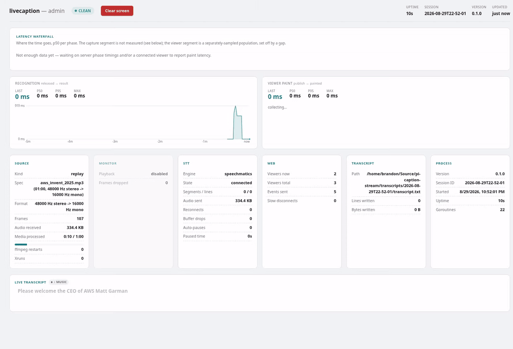

# Usage reference

[Back to the project overview](../README.md) · [Server setup](../deploy/README.md) · [Kiosk setup](../deploy-kiosk/README.md)

Commands, viewer settings, and troubleshooting for livecaption. Command examples assume
`livecaption` is on your `PATH`; for a local build, use `./bin/livecaption`.

## Commands

### `devices` — list audio inputs

```bash
livecaption devices
```

Lists capture inputs per backend (`pulse`, `alsa`) with the name to pass to `--device`.
Enumeration shells out to `ffmpeg -sources` and is best-effort: an empty list means that backend
didn't answer, not that you have no audio hardware.

### `replay` — transcribe a recording

Streams an audio file through the real pipeline at wall-clock rate, so everything downstream
behaves exactly as it will with the live feed. Reproducible run to run on `--engine mock`, since
the mock is driven by media time rather than the wall clock.

To judge caption delay by ear, add `--monitor`:

```bash
livecaption replay recording.mp3 --monitor
```

This tees the exact frames sent to the recognizer into a second `ffmpeg` writing to your default
speakers — what you hear is bit-identical to what the recognizer receives. It adds ~80 ms of
playback buffer, so perceived delay slightly overstates the real thing. Use it to tune
`--keyterm` and get a feel for lag *before* an event, not during one.

### `live` — capture live audio

```bash
livecaption live --device <name-from-devices> --keyterm "Anthropic" --keyterm "Claude"
```

`--device` is checked against `livecaption devices` before capture starts, then confirmed with a
probe read — so a typo is a clear startup error rather than room noise captioned as your event.
If enumeration fails outright for the chosen backend, validation is skipped with a logged
warning rather than blocking the run. Use `--backend alsa` if your machine has no PulseAudio or
PipeWire; ALSA device names like `hw:0,0` and `default` are accepted even when enumeration comes
back empty.

## Viewing the captions

The viewer is served at `--addr` — <http://localhost:8080/> by default. It's a bottom-anchored
rolling caption window sized in `vw`, so the same URL works on a phone, a projector, or as an OBS
browser source.

**On the network, the room can use a name instead of an IP.** The server advertises
`livecaptions.local` over mDNS for as long as it runs, so viewers type that rather than hunting
for an address. Set the name with `--mdns-name`, or pass an empty one to switch it off. This
needs `avahi-publish` (`avahi-utils` on Debian/Ubuntu/Raspberry Pi OS); if it's missing the
server logs a warning and carries on serving normally, just without the name.

To drop the `:8080` entirely and serve `http://livecaptions.local`, grant the binary the
privileged-port capability once and run with `--addr :80`:

```bash
sudo setcap 'cap_net_bind_service=+ep' ./bin/livecaption
```

Query parameters:

| param | effect |
|---|---|
| `?lines=N` | number of caption rows shown (default 5) |
| `?size=N` | base font size in `vw` |
| `?theme=light` | light theme (default is dark) |
| `?logo=0` | hides the logo — for OBS, where branding is composited downstream |
| `?wake=0` | disables the screen wake lock, gate included — for OBS sources and wall-mounted displays, where nobody is there to tap |

Over plain HTTP — the standard LAN deployment — the browser's Wake Lock API is unavailable
outside a secure context, so the viewer falls back to a silent looping video to keep the screen
awake. That needs one tap to unlock playback, so the page shows a one-time "Tap to start" gate.
Captions stream in behind it, so tapping reveals current state rather than an empty page.

Two things the screen does on its own that are worth knowing before you see them mid-event:
after 10 seconds with nothing arriving the rows roll themselves empty one at a time rather than
leaving stale text up, and when auto-pause trips the status reads `silence` with a `— silence —`
marker in the caption stack.

## Listening to the room audio

The same server also streams the audio it is captioning, at
<http://livecaptions.local:8080/audio.mp3> — full-quality MP3 off the source feed, not the
16 kHz mono downmix the recognizer gets. It is a URL, not a page: open it in anything that plays
internet radio, from an ops laptop at the back of the hall or an overflow room.

```bash
# Recommended: rides out a server restart on its own.
mpv --stream-lavf-o=reconnect=1,reconnect_streamed=1,reconnect_on_network_error=1,reconnect_delay_max=5 \
    http://livecaptions.local:8080/audio.mp3

ffplay -reconnect 1 -reconnect_streamed 1 -reconnect_on_network_error 1 \
    http://livecaptions.local:8080/audio.mp3

vlc http://livecaptions.local:8080/audio.mp3        # add --repeat for auto-reopen
curl http://livecaptions.local:8080/audio.mp3 > room.mp3   # ad-hoc recording
```

A capture restart is a gap in the bytes rather than an end of stream, so playback survives it
with no client involvement. A full server restart ends the connection, which is what the
reconnect flags above are for — bare VLC and a plain browser `<audio>` element stop dead and
need a human to press play again.

There is no backlog and no seeking: a listener joining late starts at the live edge, the same
stance the caption viewer takes. Replaying stale audio into a live room would be wrong.

Turn the stream off with `--no-audio-stream`.

## Options

Everything below is a flag on both `replay` and `live` unless noted. API keys and the admin
password are environment-only on purpose: a secret on the command line lands in every `ps`
listing and shell history on the machine.

Every flag can also be set as an environment variable — uppercase the flag name and prefix it
with `LIVECAPTION_`, so `--mdns-name` is `LIVECAPTION_MDNS_NAME`. That is how the deployed
service is configured: the systemd unit passes no arguments at all and reads everything from
`/etc/default/livecaption`. A variable that is set but empty counts as unset. (`--no-color`
keeps the conventional unprefixed `NO_COLOR`.)

| | default | |
|---|---|---|
| `--engine` | `deepgram` | `deepgram`, `speechmatics`, or `mock` |
| `--model` | per engine | `nova-3` (Deepgram) / `enhanced` (Speechmatics) |
| `--language` | per engine | `en-US` (Deepgram) / `en` (Speechmatics) |
| `--keyterm` | — | proper noun to bias recognition toward; repeatable |
| `--keyterm-file` | — | one term per line; blank lines and `#` comments ignored |
| `--auto-pause` / `--no-auto-pause` | on | drop the recognizer connection during silence |
| `--silence-hold` | `60s` | how long silence must hold before pausing |
| `--diarize` / `--no-diarize` | on | ask the recognizer who is speaking |
| `--music-detect` / `--no-music-detect` | on | suppress captions while the recognizer reports music |
| `--addr` | `:8080` | listen address for the viewer and admin pages |
| `--audio-stream` / `--no-audio-stream` | on | serve the source audio at `/audio.mp3` |
| `--mdns-name` | `livecaptions` | advertise `<name>.local`; empty disables |
| `--logo` | — | image for the viewer's top-right corner (max 2 MiB) |
| `--transcript-dir` | `./transcripts` | also `$LIVECAPTION_TRANSCRIPT_DIR` |
| `--no-transcript` | off | disable transcript recording for this session |
| `--monitor` | off | `replay` only — play the streamed audio over speakers |
| `--device` | — | `live` only, required — capture device |
| `--backend` | `pulse` | `live` only — `pulse` or `alsa` |
| `-v` / `--log-level` | `info` | `debug` also prints the caption stream to stdout |
| `--no-color` | off | also `$NO_COLOR` |

| env var | |
|---|---|
| `DEEPGRAM_API_KEY` / `SPEECHMATICS_API_KEY` | key for the selected `--engine`; only the matching one is read |
| `ADMIN_PASSWORD` | enables the `/admin` clear-screen control and guards `/admin` with basic auth (user: `admin`) |

### Automatic behaviour

**Auto-pause.** Silence closes the recognizer connection and audio reopens it, so a quiet room
doesn't rack up charges. The silence threshold is a compile-time constant (-45 dBFS), not a
flag — a materially hotter or colder feed needs it moved and a rebuild. Turn the feature off for
a venue where dead air should keep the connection warm, or raise `--silence-hold` if pauses fire
during ordinary pauses for breath. See [DESIGN.md §3](../DESIGN.md).

**Speakers.** Both engines label the speaker for every word, so a segment spanning a turn is
split into one caption per speaker rather than credited to whoever started it. A change of
speaker always breaks the row — two people's words never share a line. On screen it shows as a
small coloured numbered dot in a left gutter, on the first row of a turn only; the gutter is
always reserved, so it never appears mid-session and slides painted words sideways. Six colours
cycle and the number stays authoritative past that. Labels are cluster indices, not identities:
stable within a connection, renumbered after a reconnect.

**Music.** Speechmatics can flag music in the feed; Deepgram has no equivalent, so the flag does
nothing there. While music plays captions are suppressed — sung lyrics come back as garble — and
the status reads `♪ music` so a frozen screen reads as deliberate rather than broken. The open
transcript line closes at the first note. The detector can be over-sensitive: a loud room or an
instrument under speech can trip it. Each event is logged with its time and confidence, so if
it's swallowing speech, run with `--no-music-detect`.

**Audio streaming.** The room audio is served at `/audio.mp3` alongside the captions, encoded as
a second output of the same ffmpeg that feeds the recognizer — so there is no second capture and
no drift. If it can't run (an ffmpeg built without `libmp3lame`, say) the captions carry on
untouched: the startup banner reads `audio  disabled` with the reason, the log carries a
warning, and `/admin` shows the Audio stream card as `failed`. A listener that stops reading is
dropped rather than allowed to stall capture, which is counted on the same card.

**Profanity.** Filtered on both engines, always, with no flag. Speechmatics drops the word
entirely — nothing is shown where it was, and surrounding words keep their own timing so the
line still paces normally. Deepgram masks with asterisks. The word list belongs to the
recognizer and can't be edited from here; Speechmatics tags profanity for English, Spanish and
Italian only.

**Speech timing.** A pause of at least 1.5s counts as the speaker actually stopping: it freezes
the caption row and closes a transcript line. That threshold is a compile-time constant too, not
a flag. Since every engine publishes only settled results, cadence is governed by the
recognizer's own finalisation window — see [DESIGN.md §4](../DESIGN.md).

## Operator dashboard: `/admin`



A metrics dashboard polling `/api/stats` once a second, plus a mirror of the live captions.
Check it during an event to confirm nothing is degrading silently.

- **Status badge** — **Clean** / **Degraded** / **STT Paused** / **Closed**. An auto-pause shows
  as "STT Paused," not "Degraded": it's expected, money-saving behaviour, not a fault. A past
  blip holds the badge at "Degraded" only briefly rather than for the rest of the session.
- **Latency** — caption-segment percentiles over a trailing 5-minute window headline the page.
  Since everything reaching the display is already settled text, that figure *is*
  time-to-first-pixels. A second row shows viewer-reported publish→paint latency, measured as the
  word leaves the paced display queue, so it includes the cadence backlog rather than just the
  wire hop. The waterfall below breaks a segment into upload / recognize / assemble phases, with
  the unmeasured capture leg drawn as a labelled hatched segment.
- **Segments / lines** — the fragmentation readout. Roughly 1–3 segments per line is healthy; a
  ratio climbing well past that means phrases are splitting on every hesitation.
- **Counters** — restarts, xruns, STT reconnects, buffer drops, auto-pause count and total
  paused time, SSE client counts.

One operator control: **Clear screen**, which blanks every connected viewer immediately, for
when something lands on screen that shouldn't stay there. The server closes the in-progress
transcript line as it goes, so the cleared text still reaches `transcript.txt`.

Set `ADMIN_PASSWORD` to require basic auth (username `admin`) for both `/admin` and
`POST /api/clear`. Without it, the dashboard stays open, the button is disabled, and the clear
API returns 503. Basic auth over plain HTTP is intended only for a trusted LAN; it does not
encrypt the password.

`GET /healthz` returns `ok` — useful for a headless box you can't see.

## Transcripts

On by default. Every session writes `./transcripts/<YYYY-MM-DDTHH-MM-SS>/transcript.txt`,
timestamped and human-readable, with an `[S2]` prefix when the speaker is known. Change the
location with `--transcript-dir` or `$LIVECAPTION_TRANSCRIPT_DIR`; disable with
`--no-transcript`.

## stdout vs stderr

Finalized captions go to stdout; logs and the status line go to stderr, so they split cleanly:

```bash
livecaption replay recording.mp3 > captions.txt 2> run.log
```

At the default log level stdout carries no captions, so watching a session shows only the status
line and the terminal doesn't fill with caption text. Pass `-v` to get the live stream on stdout.
Either way, every line also reaches `transcript.txt`.

## Event checklist

- **Feed a mono aux/matrix send of the mics, not the main mix.** The pipeline will happily
  downmix music and effects along with speech. This is the single biggest accuracy lever in the
  project.
- **Set `--keyterm` for every proper noun** in the event — names, places, in-house terms. Costs
  nothing, helps a lot. For a long list, put one term per line in a file and pass
  `--keyterm-file`, ordered most-likely-spoken first: Speechmatics takes 1000 terms, Deepgram
  only the first 400, and the cut comes off the end.
- **Do a `--monitor` dry run beforehand**, on `replay` with representative audio, to hear and
  tune perceived delay before you're live.
- **Check `/admin` shows a clean run** — no restarts, no reconnects, no buffer drops — before
  trusting the feed.

## Troubleshooting

- **401 on first connect** — check the env var for your engine. Only the variable matching
  `--engine` is read, so having the other one set doesn't help. The run stops immediately rather
  than retrying, and so does a rejected `--model` or `--language`.
- **`unknown stt engine`** — only `deepgram`, `speechmatics` and `mock` exist.
- **First connect is slow with a big `--keyterm-file`** — Speechmatics builds the dictionary
  before acknowledging the session, up to 15 s the first time. It caches identical lists for
  24 h, so later connections (including every auto-pause redial) are quick. Don't edit the list
  between runs on the day for no reason: any change is a new dictionary and a new cold start.
- **No devices listed by `devices`** — confirm `ffmpeg` is on `PATH` and a sound server
  (PulseAudio / PipeWire) is running. ALSA enumeration commonly comes back empty even when ALSA
  devices work fine, so also try `hw:0,0` or `default` directly with `live --backend alsa`.
- **`livecaptions.local` doesn't resolve** — install `avahi-utils` and check `avahi-daemon` is
  running. The server logs a warning at startup when it can't advertise. The viewer still works
  at the machine's IP either way.
- **Captions lagging** — text lands when the recognizer finalizes a window, so that window is
  the knob, and it's a compile-time constant per engine. Check the latency waterfall on `/admin`
  to see which leg is slow, watch **Segments / lines** for fragmentation, and see
  [DESIGN.md §4](../DESIGN.md).
- **The screen empties on its own** — after 10 seconds with no captions the rows decay to blank
  rather than leaving stale text up. Expected.
- **First word after a quiet spell is missing or late, or the connection pauses during ordinary
  pauses for breath** — auto-pause. Loosen it with a longer `--silence-hold`, or disable it with
  `--no-auto-pause`.

